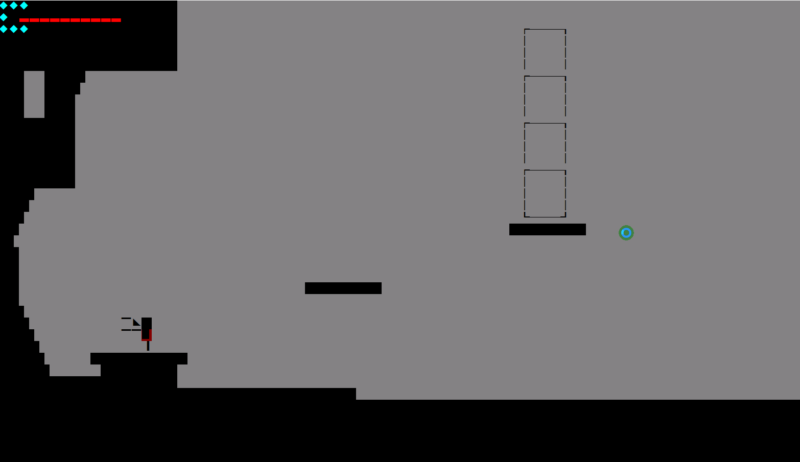
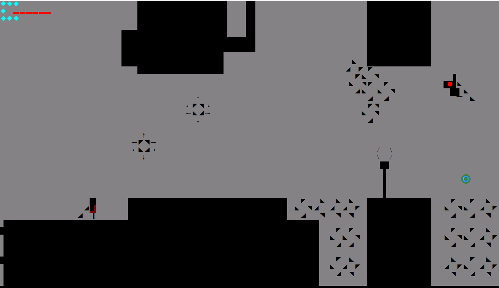
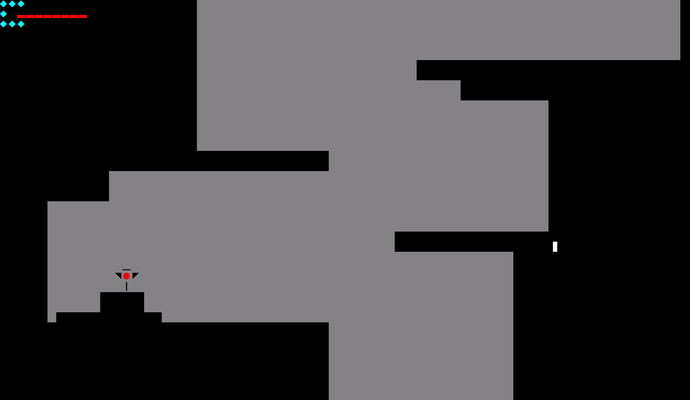

# MyGame-2015
---

- 大一 -> 2015
- 参加学校比赛写的一个小游戏
- 现在看来只是一个toy 
  - 当时初学编程 -> 第一次写一个自己的项目
  - 代码很烂
  - 但是第一次有了打代码很爽的体验 -> 还拿了个二等奖(很开心)
- 保存一下 -> 算作是自己的一点纪念吧
- vs 编译 + windows api

目录结构

- MyGame.zip 保存游戏的 vs 项目 大概1w多行代码(大量冗余)
- record 目录保存当时的录像文件
- MyGame.exe 保存编译好的release 版本(运行可能需要一些库)

简单介绍

- 游戏模仿(点灯精灵)游戏实现 + 超级玛丽 -> 类似剪影风格
- 6道关卡 -> 用箭头上下左右控制 -> enter 键为进入 -> space 后退 -> esc 退出
- 存档默认保存在 -> d:\MyGame 目录下
- 有多个角色形象 -> 死亡之后会随机更换

运行效果类似下面

